# Introduction to the new Plugin Manager in RPG Maker MV 1.5.0+

RPG Maker MV just get updated with the new Plugin Manager. You can create powerful plugins like the following one now!


## Group Parameters (@parent)

You can use `@parent` to set the parent parameter. Just append the name of parent parameter after `@parent`.

```
/*:
 * @param C:\
 *
 * @param Windows
 * @parent C:\
 *
 * @param System32
 * @parent Windows
 *
 * @param notepad.exe
 * @parent System32
 *
 * @param shell32.dll
 * @parent System32
 *
 * @param explorer.exe
 * @parent Windows
 *
 * @param D:\
 *
 * @param Documents
 * @parent D:\
 */
```

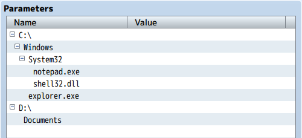

This won't change the syntax when reading the values in game.

```
PluginManager.parameters('TreeDemo')['notepad.exe']
```

## Localization Labels (@text)

The name of the parameter can be different from the name shown in editor now. You can use `@text` to specify the name shown in editor.

```
/*:
 * @param enable
 * @text Enable the Quest System
 * @default true
 *
 * @param mainmenu
 * @text Show in Main Menu
 * @parent enable
 */
```

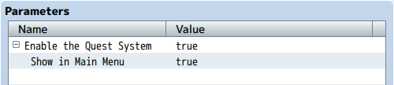

To retrieve the value in game, use the name specified by @param instead @text:

```
PluginManager.parameters('TextDemo')['enable']
# => "true"

PluginManager.parameters('TextDemo')['Enable the Quest System']
# => undefined
```

## Typings (@type)

### Text

```
@type text
```

This directive will create the edtior for single-line string. Just like all the previous version, this is the very basic one.

If you specify an invalid type or just omit the `@type` directive, this will be used.

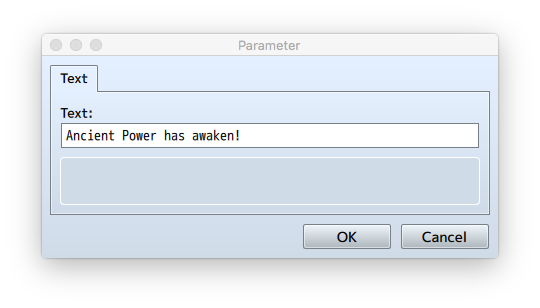

### Note

```
@type note
```

This directive will create the editor for multi-line string.

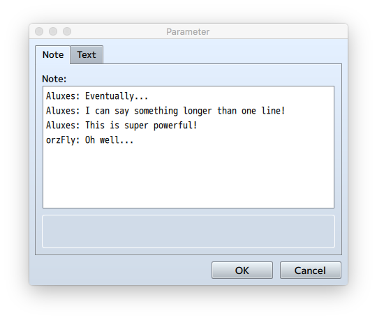

Note: the result of this directive is a JSON-escaped string. This means if you are reading the value in game, you need to JSON.parse it to get the real value.

```
var value = PluginManager.parameters('PluginEditorDemo')['Note']

console.log(value)
# => "Aluxes: Eventually...\nAluxes: I can say something longer than one line!\nAluxes: This is super powerful!\norzFly: Oh well..."

console.log(JSON.parse(value))
# => Aluxes: Eventually...
# => Aluxes: I can say something longer than one line!
# => Aluxes: This is super powerful!
# => orzFly: Oh well...
```

### Number

```
@type number
```

This directive will create the editor for a number with the up/down spin button.


```
@max 100
@min -100
```

These two directives can be used to set the range for the parameter.

```
@decimals 2
```

This directive will allow the number to have some decimal places. If this is omitted, the number can only be an integer.

### File

```
@type file
```

This directive will create the editor for specifying an image resource or an audio resource.

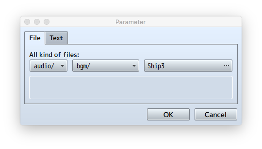

```
@dir audio/bgm/
```

This directive will set the base directory for the file so the file picker will be scoped to this directory. This path will not be included in the result.

```
@require 1
```
If this directive is present, the file specified by this parameter will be included in the deployment if "Exclude unused files" is chosen.

### Object Selector

```
@type animation
@type actor
@type class
@type skill
@type item
@type weapon
@type armor
@type enemy
@type troop
@type state
@type tileset
@type common_event
@type switch
@type variable
```

These directives will create the editor allowing the use to pick an item of the object. The object ID will be the result. If None is chosen, the result will be 0.


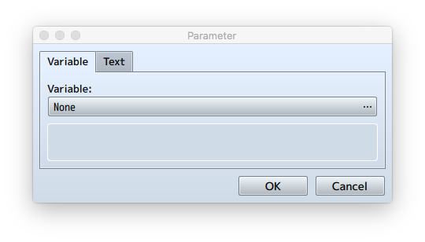

```
@require 1
```
(`@type animation` only) If this directive is present, the animation specified by this parameter will be included in the deployment if "Exclude unused files" is chosen.

### Boolean

```
@type boolean
```

This directive will create the editor with two radio options returning a true/false value. The default labels are "ON" and "OFF".

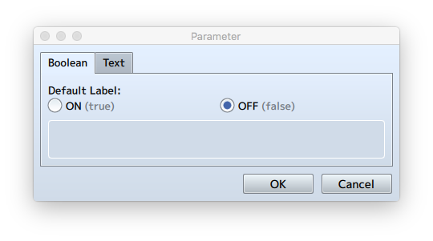

```
@on Enable
@off Disable
```

You can override the label with @on and @off directives.

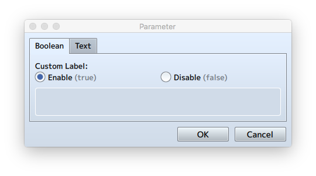

### Select

```
@type select
@option XP
@option VX
@option VX Ace
@option MV
```

This directive will create a drop-down box allowing the user to pick one from predefined options. The value will be the label of the option.

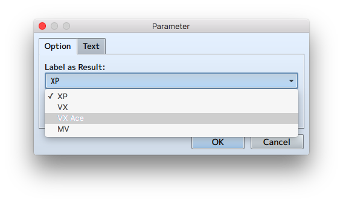

```
@type select
@option XP
@value 1.0
@option VX
@value 2.0
@option VX Ace
@value 2.1
@option MV
@value 3.0
```

You can also override the value by providing the `@value` directive for each `@option`.

### Combo

```
@type combo
@option XP
@option VX
@option VX Ace
@option MV
```

This directive will create a text box with a drop-down menu allowing the user to type the text on his own. The user also can pick one from predefined options.

`@value` directives are not supported in Combo mode.

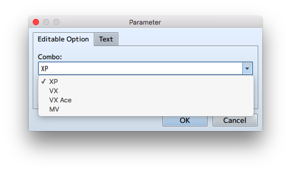

### List

By append `[]` to any valid type, the editor will be upgraded to a list type. For example, these directives are all valid.

```
@type text[]
@type note[]
@type number[]
@type variable[]
@type item[]
@type combo[]
@type file[]
@type struct<Anything>[]
```

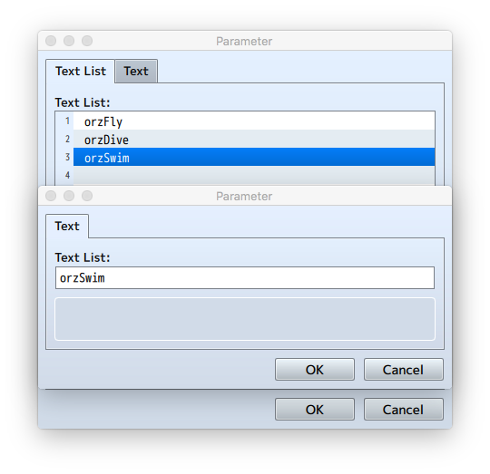

Note: the result of this type is a JSON-escaped array of strings. This means if you are reading the value in game, you need to JSON.parse it to get the real value.

```
var value = PluginManager.parameters('PluginEditorDemo')['Text List']

console.log(value)
# => ["orzFly","orzDive","orzSwim"]

console.log(value[2])
# => o

var realValue = JSON.parse(value)
console.log(realValue[2])
# => orzSwim
```

### Structure

You can define a structure by starting a new comment block in the file. You can put it after the main comment block. The first line defines the name of this struct ("ItemAward" in the example). You can define parameters like normal inside this structure block.

```
/*~struct~ItemAward:
 * @param Item
 * @type item
 * 
 * @param Count
 * @type number
 * @min 1
 * @max 99
 * @default 1
 */
```

You can later use this structure by using a special type:

```
@type struct<ItemAward>
```

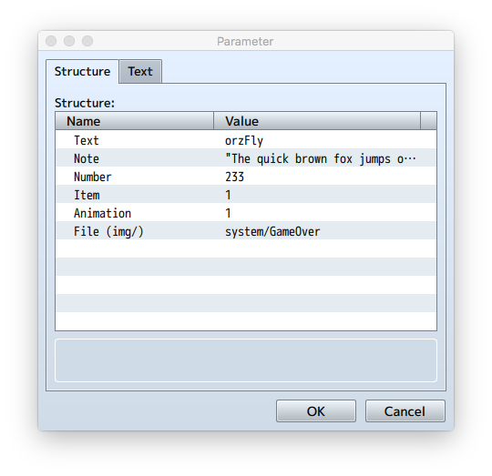

Note: the result of this type is a JSON-escaped object. This means if you are reading the value in game, you need to JSON.parse it to get the real value.

```
var value = PluginManager.parameters('PluginEditorDemo')['Structure']

console.log(value)
# => {"Text":"orzFly","Note":"\"The quick brown fox jumps over the lazy dog.\\nThe lazy dog jumps over the quick brown fox.\\nThe quick brown fox jumps over the quick brown fox.\\nThe lazy dog jumps over the lazy dog.\"","Number":"233","Item":"1","Animation":"1","File (img/)":"system/GameOver"}

console.log(value["Text"])
# => undefined

var realValue = JSON.parse(value)
console.log(realValue["Text"])
# => orzFly
```

--

An example plugin is available in the attachment and also on [GitHub](https://github.com/orzFly/rpgmaker-mv-plugins/blob/master/plugins/PluginEditorDemo.js). This plugin is intended to demonstrate the new Plugin Manager in RPG Maker MV v1.5.0 only so it doesn't have any real functionalities.